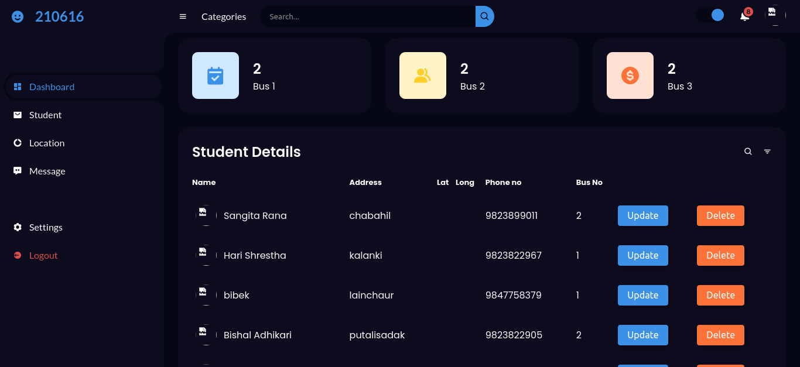
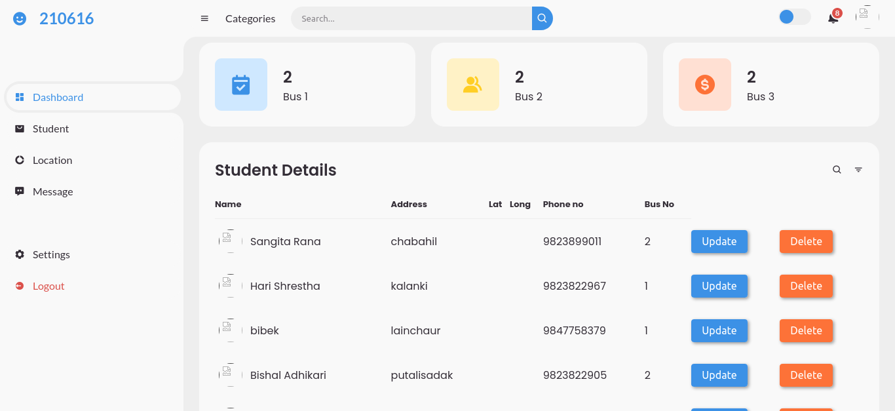
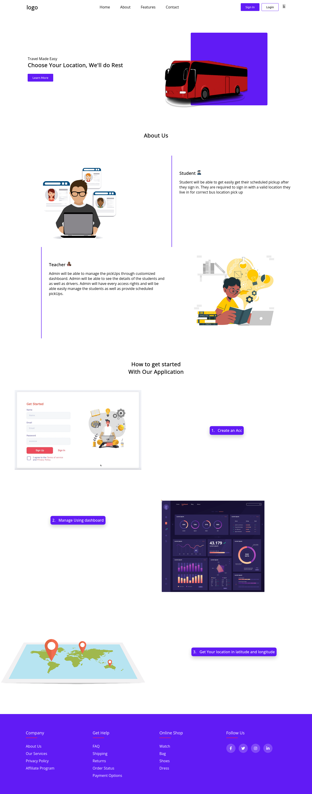
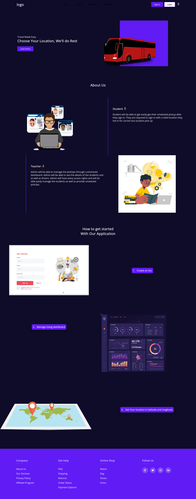
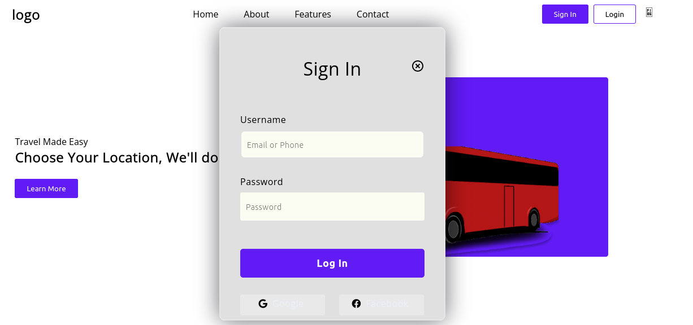
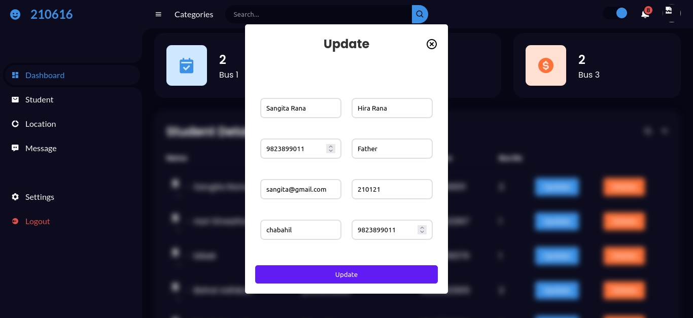

                                                       BusPickUpProject 
            
Some of the feature project contains

1. User will be able to sign in they will be automatically assign to the bus no based on their address provided
2. User will be login with the details they have signed in before note:- password will be the roll_id of the user
3. When signing the by default they will be treated as a student and redirected to their own dashboard
4. If they want the admin access they should change the user_tpe to admin in the student column manually then next time 
   they are logging in they will be given their own dashboard
5. If the current user is admin they will be able to see all  the details of the student on the dashboard where
   they have access to search for the particular user using search bar 
6. Admin can even add and delete locations from the dashboard and change the route_id,location_id and address.
7. When the admin changes the address the bus no will be changed based on the address and route it is being assigned to 
8. Dashboard has dark-mode functionality which can be easier to see the details
9. Roll_id can be seen on the top of the dashboard who is currently being signed in 
10. Admin can send the message with the recipient name on it 
11. There is a profile section where user will be able to see all their details in it
                                   <h2>
Some Images Of Project
</h2>
 

   

     

 

  

  

 

  

  

   
  

